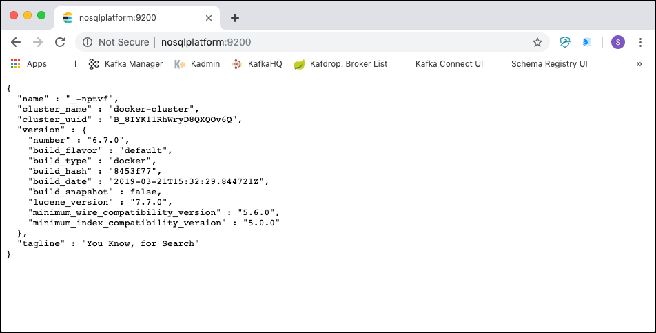
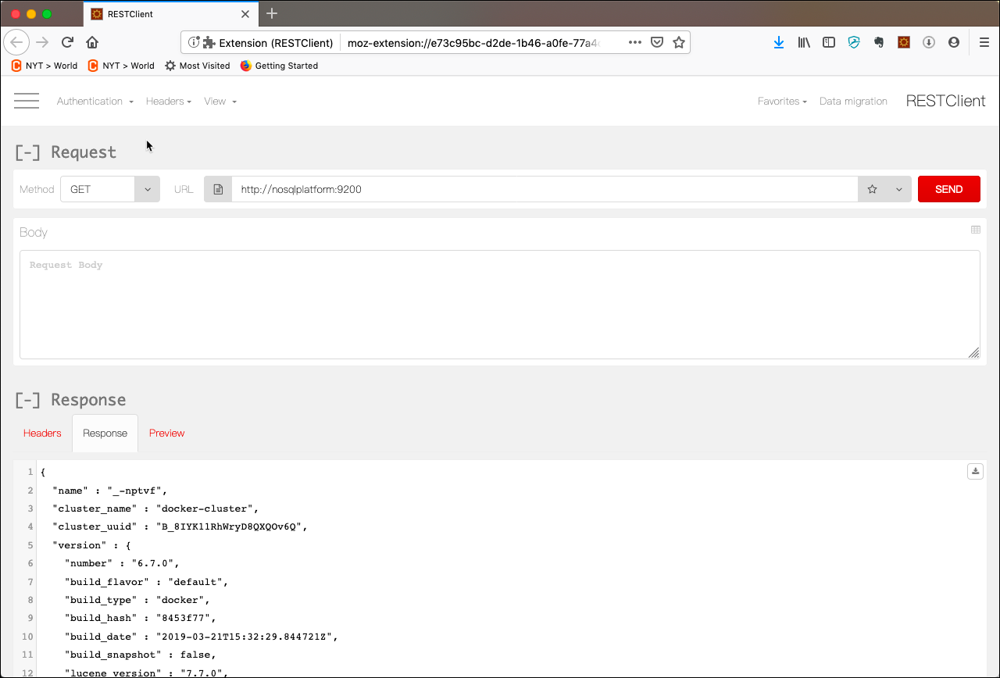
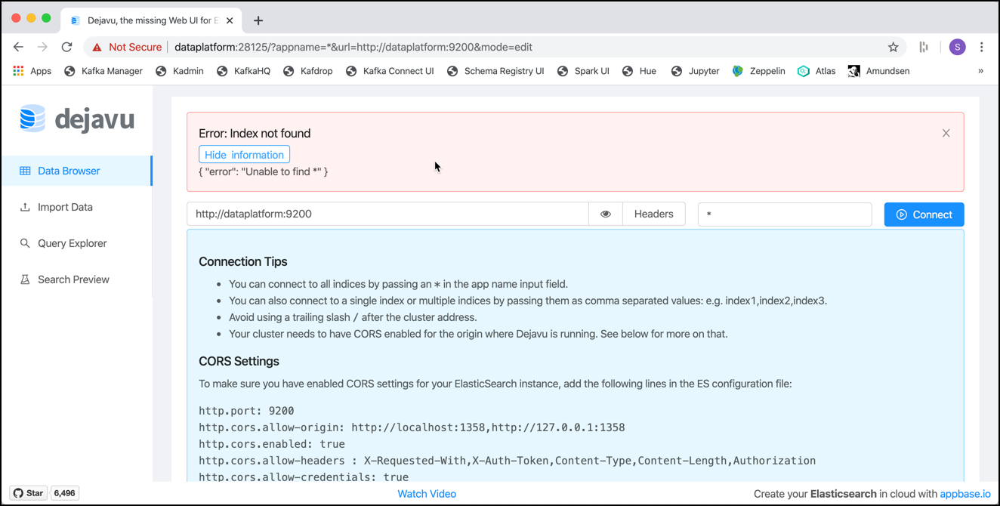
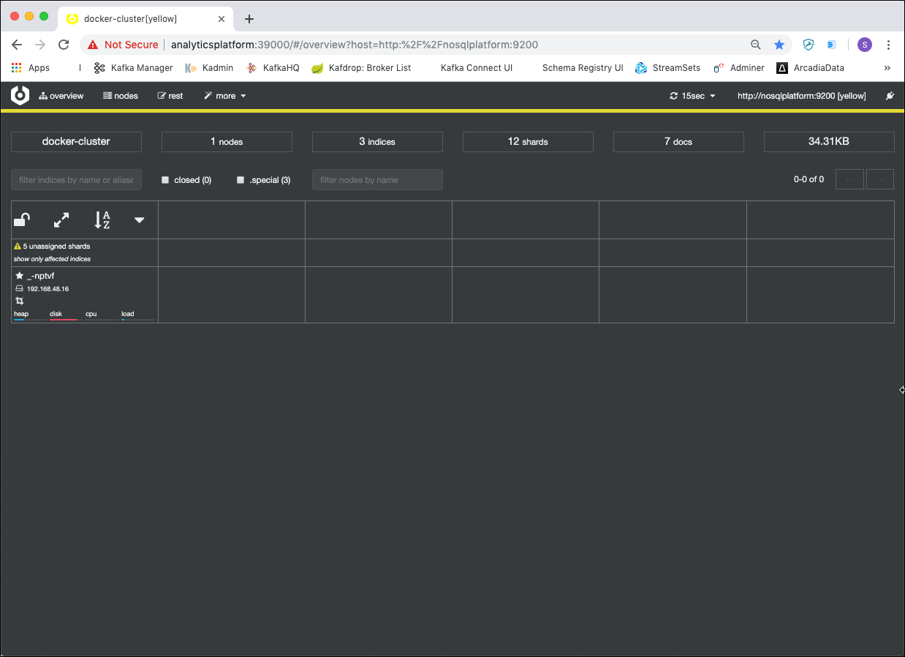
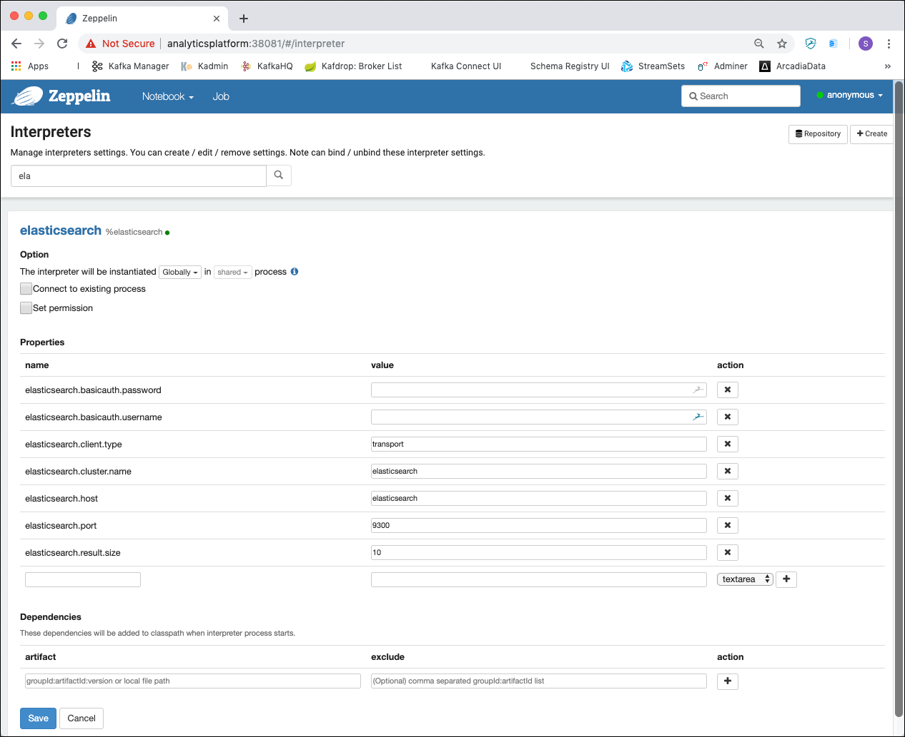
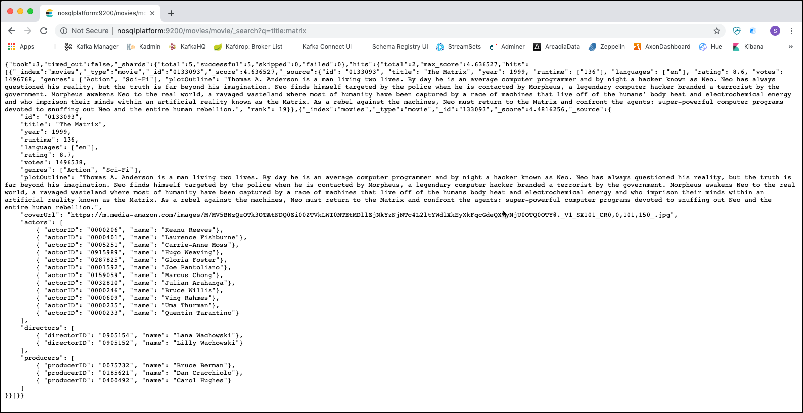

# Working with Elasticsearch

In this workshop we will learn how to use the Elasticsearch NoSQL database.

We assume that the platform described [here](../01-environment) is running and accessible. 

## Table of Contents

- [What you will learn](#what-you-will-learn)
- [Prerequisites](#prerequisites)
- [Connecting to the Elasticsearch environment](#connecting-to-the-elasticsearch-environment)
- [Create a Mapping](#create-a-mapping)
- [Insert, Update and Delete Operations](#insert-update-and-delete-operations)
- [Let's add a few movies](#lets-add-a-few-movies)
- [Analysers](#analysers)
- [Searching in Elasticsearch](#searching-in-elasticsearch)
- [Using Elasticsearch from Python](#using-elasticsearch-from-python)

## What you will learn

- How to connect to Elasticsearch via its REST API and browser-based GUIs
- How to create index mappings to define document structure
- How to insert, update, and delete documents
- How to configure and use analysers for text processing
- How to perform URI search, query/filter, phrase, and proximity searches
- How to sort search results
- How to interact with Elasticsearch using the Python API

## Prerequisites

- The **Data Platform** described [here](../01-environment) is running and accessible

## Connecting to the Elasticsearch environment

### Using REST API

Once you have an instance of Elasticsearch up and running you can talk to it using its JSON based REST API residing at localhost port 9200. You can use any HTTP client to talk to it. In ElasticSearch's own documentation all examples use curl, which makes for concise examples. However, when playing with the API you may find a graphical client such RESTClient more convenient. 

In a browser window, navigate to <http://dataplatform:9200/> just to see that Elastic Search is running. You should see the following result. 



> **What you should see:** A JSON response in the browser containing the cluster name, version number, and the tagline "You Know, for Search".

Because most of the commands use another HTTP Method than `GET`, using the browser like shown is only of limited use. 

To have more control over the HTTP method to use, the `curl` command can be used. From a terminal window, use curl and the GET method on the address specified, using JSON for the `Content-Type` header attribute.

```
curl -H "Content-Type: application/json" -XGET http://dataplatform:9200
```

You should get a result similar to the one shown below. 

```
{
  "name" : "_-nptvf",
  "cluster_name" : "docker-cluster",
  "cluster_uuid" : "B_8IYK11RhWryD8QXQOv6Q",
  "version" : {
    "number" : "6.7.0",
    "build_flavor" : "default",
    "build_type" : "docker",
    "build_hash" : "8453f77",
    "build_date" : "2019-03-21T15:32:29.844721Z",
    "build_snapshot" : false,
    "lucene_version" : "7.7.0",
    "minimum_wire_compatibility_version" : "5.6.0",
    "minimum_index_compatibility_version" : "5.0.0"
  },
  "tagline" : "You Know, for Search"
}
``` 

> **What you should see:** The same JSON cluster info — cluster name, version details, and the tagline "You Know, for Search" — confirming Elasticsearch is reachable via the REST API.

In this workshop we will be using the method with `curl` for most of the times. But there are other browser-based GUIs which can be used as well 

### Using Browser-based GUIs

There are many options to work with Elasticsearch in a browser-based way, which are more comfortable than just the plain browser. 

One option is to use a generic REST client which runs in the browser, such as the Firefox Add-On called RESTClient. 

Another option is to use a specific Elasticsearch GUI application running in a browser. The NoSQL Platform installed for this course contains the ElasticHQ, DejaVu and Cerebro as well as the Kibana application. 

A third option is to use Apache Zeppelin, similar to the Cassandra workshop, which has an Elasticsearch interpreter. 

#### Firefox RESTClient

REST Client is a Firefox Add-on, which can be used to send REST calls similar to the curl above with full-control over HTTP Method and Attributes.

Install the Add-on using the [this link](https://addons.mozilla.org/en-US/firefox/addon/restclient/?src=search). After restarting Firefox it should be available as an icon in the menu in the top right corner. 

Specify the **Method**, **URL** and **Body** fields according to your command and click on **SEND**.



#### Kibana Application

[Kibana](https://www.elastic.co/products/kibana) is part of the Elastic stack (aka. ELK Stack) and lets you visualise your Elasticsearch data and navigate the Elastic Stack. It also holds a Dev Tools interface where you can execute REST calls over a browser based window. 

In a browser window, navigate to <http://dataplatform:5601> and you should directly land on the Kibana home screen as shown below. 


Navigate to **Dev Tools** on the right to open the **Dev Tools Console** window. 

#### ElasticVue Application

Another one is [ElasticHQ](https://elasticvue.com/), an open source management and monitoring interface for Elasticsearch.

It is part of the dataplatform but it can also be installed as a [Desktop App](https://elasticvue.com/installation).

In a browser window, navigate to <http://dataplatform:28275> and click on **ADD ELASTICSEARCH CLUSTER**. Enter `http://dataplatform:9200` into the **Uri** field and click **Connect**. You should arrive on the ElasticVie home screen as shown below. 


> **What you should see:** The ElasticVue home screen showing an overview of the connected cluster and a list of available indices.

#### Dejavu Application (not installed)

[Dejavu](https://opensource.appbase.io/dejavu/) is a Web-based UI for Elasticsearch to import, browse and edit data with rich filters & query views.

In a browser window, navigate to <http://dataplatform:28125/> and you should directly arrive on the home screen as shown below. 

Enter `http://dataplatform:9200` into the URL field and `*` into the `Appname` field and then click **Connect**. 

You will get an error, because there is not yet an index available. 



But this proves that the connection to Elasticsearch worked and later, after creating the index, the connect will just work fine.

#### ElasticHQ Application (not installed)

Another one is [ElasticHQ](https://www.elastichq.org/), an open source management and monitoring interface for Elasticsearch.

This tool is not installed by default, but it is supported by [Platys](https://github.com/trivadispf/platys) and you can enable it in the `config.yml`.

If installed, then in a browser window, navigate to <http://dataplatform:28127> and you should directly land on the ElasticHQ **Connect to Elasticsearch** screen. Enter `http://dataplatform:9200` into the URL field and click **Connect**. You should arrive on the ElasticHQ home screen as shown below. 


#### Cerebro Application (not installed)

Another appliction is [Cerebro](https://github.com/lmenezes/cerebro/), an open source (MIT License) elasticsearch web admin tool built using Scala, Play Framework, AngularJS and Bootstrap.

This tool is not installed by default, but it is supported by [Platys](https://github.com/trivadispf/platys) and you can enable it in the `config.yml`.

If enabled, then in a browser window, navigate to <http://dataplatform:28126/> and you should directly land on the Cerebro **Connect** screen. Enter `http://dataplatform:9200` into the **Node address** field and click **Connect**. You should arrive on the Cerebro home screen as shown below. 



#### Apache Zeppelin (this is currently not available on dataplatform)

Another universal "data" tool is [Apache Zeppelin](http://zeppelin.apache.org). In a browser window, navigate to <http://dataplatform:28080/> and you should directly arrive on the home screen as shown below. 


Apache Zeppelin uses a so called "Notebook" based model that enables data-driven,
Interactive data analytics and collaborative documents with SQL, Scala and more.

Zeppelin uses the concept of interpreters. Each Interpreter has the capability to "talk" to a given data systems. When creating a Notebook, you can specify the "default" interpreter to use, all other interpreters can be used as well, but then the directive `%<interpreter-name>`has to be used in each cell. 

Zeppelin has an Elasticsearch interpreter, which we will use here. But before we can use it, it has to be configured. Click on **anonymous** drop-down and select **Interpreter**.

Navigate to the **Elasticsearch** Interpreter either by searching for it or scrolling down to reach it. Click on **edit** and change the **elasticsearch.host** property to `elasticsearch-1`, the **elasticsearch.port** to `9200` and the **elasticsearch.client.type** to `http`. 



Scroll-down to the end of the Interpreter settings and click **Save**. Confirm that you want Zeppelin to restart the Interpreter with the new settings. 

Click on **Zeppelin** in the upper left corner to navigate back to the Home screen. 

Now let's create a new notebook by clicking on the **Create new note** link. On the pop-up window enter `Elasticsearch` into he **Note Name** field and select **elasticsearch** for the **Default Interpreter** and click **Create**.
An empty notebook with one cell will appear. This cell is now ready to be used and has the Elasticsearch interpreted assigned. Enter each command into a separate cell and either click on the **play** icon on the right or hit **Ctrl-Enter** to execute the cell. A new cell will automatically appear when executing the current one. 

For all the commands which follow now in this workshop, you can either use one of the various different options shown above. Of course you an also mix to your liking.

## Create a Mapping

To create the mapping for the year type in Elasticsearch run the following curl command:

```bash
curl -H "Content-Type: application/json" -XPUT http://dataplatform:9200/movies -d '
{
    "mappings": {
        "properties": {
            "year": { "type": "date"}
        }
    }
}'
```

and you should get a result similar to the one bellow

```bash
gus@gusmacbook ~> curl -H "Content-Type: application/json" -XPUT http://dataplatform:9200/movies -d '
                  {
                      "mappings": {
                           "properties": {
                              "year": { "type": "date"}
                           }
                      }
                  }'

{"acknowledged":true,"shards_acknowledged":true,"index":"movies"}⏎
```

> **What you should see:** `{"acknowledged":true}` confirming the index was created successfully.
>
> **What just happened?** Elasticsearch created the `movies` index with the specified field mappings — types like `text` are analysed for full-text search while `keyword` types are stored as-is for exact matching and aggregations.

Check that the mapping was correctly loaded by getting it back using the following command:

```bash
curl -H "Content-Type: application/json" -XGET http://dataplatform:9200/movies/_mapping?pretty
```

## Insert, Update and Delete Operations 

First we use a single movie and see the various modify operations on Elasticsearch. 

### Insert a movie

Let's insert the movie "Pulp Fiction" into the `movies` index we have created before

```bash
curl -XPUT "http://dataplatform:9200/movies/_doc/110912" -H 'Content-Type: application/json' -d'
{
    "id": "110912", 
    "title": "Pulp Fiction",
    "year": 1994,
    "runtime": 154,
    "languages": ["en", "es", "fr"],
    "rating": 8.9,
    "votes": 2084331,
    "genres": ["Crime", "Drama"],
    "plotOutline": "Jules Winnfield (Samuel L. Jackson) and Vincent Vega (John Travolta) are two hit men who are out to retrieve a suitcase stolen from their employer, mob boss Marsellus Wallace (Ving Rhames). Wallace has also asked Vincent to take his wife Mia (Uma Thurman) out a few days later when Wallace himself will be out of town. Butch Coolidge (Bruce Willis) is an aging boxer who is paid by Wallace to lose his fight. The lives of these seemingly unrelated people are woven together comprising of a series of funny, bizarre and uncalled-for incidents.",
    "coverUrl": "https://m.media-amazon.com/images/M/MV5BNGNhMDIzZTUtNTBlZi00MTRlLWFjM2ItYzViMjE3YzI5MjljXkEyXkFqcGdeQXVyNzkwMjQ5NzM@._V1_SY150_CR1,0,101,150_.jpg",
    "actors": [
        { "actorID": "0000619", "name": "Tim Roth"},
        { "actorID": "0001625", "name": "Amanda Plummer"},    
        { "actorID": "0522503", "name": "Laura Lovelace"},         
        { "actorID": "0000237", "name": "John Travolta"},   
        { "actorID": "0000168", "name": "Samuel Jackson"},   
        { "actorID": "0482851", "name": "Phil LaMarr"},   
        { "actorID": "0001844", "name": "Frank Whaley"},  
        { "actorID": "0824882", "name": "Burr Steers"},  
        { "actorID": "0000246", "name": "Bruce Willis"}, 
        { "actorID": "0000609", "name": "Ving Rahmes"},         
        { "actorID": "0000235", "name": "Uma Thurman"},
        { "actorID": "0000233", "name": "Quentin Tarantino"}
    ],
    "directors": [
        { "directorID": "0000233", "name": "Quentin Tarantino"}
    ],
    "producers": [
        { "producerID": "0004744", "name": "Lawrence Bender"},
        { "producerID": "0000362", "name": "Danny DeVito"},
        { "producerID": "0321621", "name": "Richard N. Gladstein"},        
        { "producerID": "0787834", "name": "Michael Shamberg"},        
        { "producerID": "0792049", "name": "Stacey Sher"},  
        { "producerID": "0918424", "name": "Bob Weinstein"},  
        { "producerID": "0005544", "name": "Harvey Weinstein"}  
    ]
}'
```

> **What you should see:** A response containing `"result":"created"` and the assigned `_id` (e.g. `"_id":"110912"`).
>
> **What just happened?** Elasticsearch indexed the document — it was tokenised, analysed, and added to the inverted index, making it immediately searchable.

### Retrieve the movie

You can now use the `GET` http method against the **movies** index to check if the movie has been added to the index.

First let's search for all documents 

```bash
curl -XGET http://dataplatform:9200/movies/_search
```

We can also tell the REST API to pretty print the results, i.e. where the Json document is nicely formatted

```bash
curl -XGET http://dataplatform:9200/movies/_search?pretty
```

but of course as we know the id of the document, we can also retrieve specifically that document

```bash
curl -XGET http://dataplatform:9200/movies/_doc/110912
```

> **What you should see:** The full document JSON in the `_source` field along with metadata fields `_index`, `_id`, and `"found": true`.

### Update the movie

Now let's see how we can update the title of the movie we have stored before. Let's say we want to append the `year` to the `title` field. 

```bash
curl -H "Content-Type: application/json" -XPOST http://dataplatform:9200/movies/_update/110912?pretty -d '
{
    "doc": {
        "title": "The Matrix (1999)"
    }
}'
```

in the answer we can see that the version of the document has been increase to 2. 

```bash
bash-3.2$ curl -H "Content-Type: application/json" -XPOST http://dataplatform:9200/movies/_update/110912?pretty -d '
{
    "doc": {
        "title": "The Matrix (1999)"
    }
}'
{
  "_index" : "movies",
  "_id" : "110912",
  "_version" : 2,
  "result" : "noop",
  "_shards" : {
    "total" : 0,
    "successful" : 0,
    "failed" : 0
  },
  "_seq_no" : 1,
  "_primary_term" : 1
}
```

> **What you should see:** A response containing `"result":"updated"` (or `"result":"noop"` if the value was unchanged) and the incremented `_version` number.
>
> **What just happened?** Elasticsearch updates are actually delete-and-reindex operations internally — the old document version is marked deleted and a new version is indexed.

Let's see if the update was successful

```bash
curl -XGET http://dataplatform:9200/movies/_doc/110912?pretty
```

We can also see the version of the document in the header. 

### Delete the movie

Last but not least let's remove the movie by using the DELETE method on the URI.

```bash
curl -XDELETE http://dataplatform:9200/movies/_doc/110912
```

> **What you should see:** A response containing `"result":"deleted"`.

Let's see if the delete was successful

```bash
curl -XGET http://dataplatform:9200/movies/_doc/110912?pretty
```

We should no longer get the document back but instead get a `"found" : false` result

```bash
bash-3.2$ curl -XGET http://dataplatform:9200/movies/movie/110912?pretty
{
  "_index" : "movies",
  "_type" : "movie",
  "_id" : "110912",
  "found" : false
}
```

## Let's add a few movies

**Note:** this only works from a terminal window, not from the graphical UIs (like Kibana).

Now let's add some more movies. This time we are using a file to hold the document and reference it from the `curl` command.

```bash
curl -XPUT "http://dataplatform:9200/movies/_doc/110912" -H 'Content-Type: application/json' --data-binary @$DATAPLATFORM_HOME/../../05-working-with-elasticsearch/data/pulp-fiction.json

curl -XPUT "http://dataplatform:9200/movies/_doc/133093" -H 'Content-Type: application/json' --data-binary @$DATAPLATFORM_HOME/../../05-working-with-elasticsearch/data/the-matrix.json

curl -XPUT "http://dataplatform:9200/movies/_doc/0137523" -H 'Content-Type: application/json' --data-binary @$DATAPLATFORM_HOME/../../05-working-with-elasticsearch/data/fight-club.json

curl -XPUT "http://dataplatform:9200/movies/_doc/0068646" -H 'Content-Type: application/json' --data-binary @$DATAPLATFORM_HOME/../../05-working-with-elasticsearch/data/the-godfather.json

curl -XPUT "http://dataplatform:9200/movies/_doc/0120737" -H 'Content-Type: application/json' --data-binary @$DATAPLATFORM_HOME/../../05-working-with-elasticsearch/data/lord-of-the-rings.json

curl -XPUT "http://dataplatform:9200/movies/_doc/4154796" -H 'Content-Type: application/json' --data-binary @$DATAPLATFORM_HOME/../../05-working-with-elasticsearch/data/avengers-endgame.json
```

## Analysers

Firstly let's try some searches. First lets try a match search for 'The Matrix':

```bash
curl -H "Content-Type: application/json" -XGET http://dataplatform:9200/movies/_search?pretty -d '
{
    "query": {
        "match": { 
            "title": "The Matrix" 
        }
    }
}'
```

> **What you should see:** Documents matching the query, ranked by relevance score.

You will notice that **The Godfather** and **The Lord of the Rings** is listed as well as **The Matrix**. This is because the analyser used is the default full text / partial match analyser. Additionally, **The Godfather** appears even above (with more relevance) than **The Matrix** due to the small number of documents across many shards. A larger corpus of documents would fix/improve the relevancy.

Let's search for a genre of 'sci' as follows

```bash
curl -H "Content-Type: application/json" -XGET http://dataplatform:9200/movies/_search?pretty -d '
{
    "query": {
        "match_phrase": { 
            "genres": "sci" 
        }
    }
}'
```

> **What you should see:** Only documents containing the exact phrase "sci" in the `genres` field.
>
> **What just happened?** Phrase queries require the terms to appear adjacent and in the same order, unlike a regular `match` which allows any order.

You will notice that the results might not be as expected since the results are all films with 'sci' such as 'Sci-Fi'. 

The expected results for requesting a phrase match of 'sci' might be zero documents.

We can fix these issues by specifying analysers to use at the mapping. To do this we need to delete our entire index, update the mapping and reindex the documents again.

To delete the index run this command:

```bash
curl -H "Content-Type: application/json" -XDELETE http://dataplatform:9200/movies
```

Then update the mappings as follows:

```bash
curl -H "Content-Type: application/json" -XPUT http://dataplatform:9200/movies -d '
{
    "mappings": {
        "properties": {
             "id": { "type": "integer"},
             "year": { "type": "date"},
             "genres": { "type": "keyword" },
             "title": { "type": "text", "analyzer": "english"},
             "plotOutline": { "type": "text", "analyzer": "english"}
         }
    }
}'
```

> **What you should see:** `{"acknowledged":true}` confirming the index was re-created with the updated mappings.
>
> **What just happened?** Elasticsearch created the index with the specified field mappings — types like `text` are analysed for full-text search while `keyword` types are stored as-is for exact matching and aggregations.

So to recap what just happened here:
 * For string/text fields that should be exact matches then define as a keyword mapping
 * For string/text fields that should be partial matches based on relevance then define as a text mapping together with an optional analyser like 'english'

Now reimport the data

```bash
curl -XPUT "http://dataplatform:9200/movies/_doc/110912" -H 'Content-Type: application/json' --data-binary @$DATAPLATFORM_HOME/../../05-working-with-elasticsearch/data/pulp-fiction.json

curl -XPUT "http://dataplatform:9200/movies/_doc/133093" -H 'Content-Type: application/json' --data-binary @$DATAPLATFORM_HOME/../../05-working-with-elasticsearch/data/the-matrix.json

curl -XPUT "http://dataplatform:9200/movies/_doc/0137523" -H 'Content-Type: application/json' --data-binary @$DATAPLATFORM_HOME/../../05-working-with-elasticsearch/data/fight-club.json

curl -XPUT "http://dataplatform:9200/movies/_doc/0068646" -H 'Content-Type: application/json' --data-binary @$DATAPLATFORM_HOME/../../05-working-with-elasticsearch/data/the-godfather.json

curl -XPUT "http://dataplatform:9200/movies/_doc/0120737" -H 'Content-Type: application/json' --data-binary @$DATAPLATFORM_HOME/../../05-working-with-elasticsearch/data/lord-of-the-rings.json

curl -XPUT "http://dataplatform:9200/movies/_doc/4154796" -H 'Content-Type: application/json' --data-binary @$DATAPLATFORM_HOME/../../05-working-with-elasticsearch/data/avengers-endgame.json
```
And perform the search for 'The Matrix' again

```bash
curl -H "Content-Type: application/json" -XGET http://dataplatform:9200/movies/_search?pretty -d '
{
    "query": {
        "match": { 
            "title": "The Matrix" 
        }
    }
}'
``` 

> **What you should see:** Documents matching the query, ranked by relevance score — this time only results with "Matrix" in the title should appear because the `english` analyser is now applied.

So now our search for a genre of 'sci' will no longer return a result

```bash
curl -H "Content-Type: application/json" -XGET http://dataplatform:9200/movies/_search?pretty -d '
{
    "query": {
        "match_phrase": { 
            "genres": "sci" 
        }
    }
}'
```

> **What you should see:** An empty hits array — no documents are returned because `genres` is now a `keyword` field requiring an exact match, and "sci" does not exactly match any stored genre value.

We now have to search for an exact match, for example we can search for 'sci-fi'

```bash
curl -H "Content-Type: application/json" -XGET http://dataplatform:9200/movies/_search?pretty -d '
{
    "query": {
        "match_phrase": { 
            "genres": "sci-fi" 
        }
    }
}'
```

> **What you should see:** An empty hits array — the `keyword` field is case-sensitive, so "sci-fi" does not match "Sci-Fi".

We still don't get any result. The search is even case sensitive, so it really has to be an exact match, so a search for 'Sci-Fi' will return us the movie

```bash
curl -H "Content-Type: application/json" -XGET http://dataplatform:9200/movies/_search?pretty -d '
{
    "query": {
        "match_phrase": { 
            "genres": "Sci-Fi" 
        }
    }
}'
```

> **What you should see:** Only documents containing the exact phrase "Sci-Fi" in the `genres` field.
>
> **What just happened?** Phrase queries require the terms to appear adjacent and in the same order, unlike a regular `match` which allows any order.

## Searching in Elasticsearch

In order to have some more data, let's import some more data.

### Inserting Top-250 movies

We can import the Top 250 rated movies, available in [data/top250-movies.json>](./data/top250-movies.json)

```bash
curl -H "Content-Type: application/json" -XPUT http://dataplatform:9200/_bulk?pretty --data-binary @$DATAPLATFORM_HOME/../../05-working-with-elasticsearch/data/top250-movies.json
```

### Query Lite / URI Search

Short hand query syntax which can be useful for debugging and testing out search. 

Let's find all movies where the title contains 'matrix'

```bash
curl http://dataplatform:9200/movies/_search?q=title:matrix 
```

and you should get a result similar to the one bellow

```bash
gus@gusmacbook ~> curl http://dataplatform:9200/movies/_search?q=title:matrix
{"took":0,"timed_out":false,"_shards":{"total":1,"successful":1,"skipped":0,"failed":0},"hits":{"total":{"value":2,"relation":"eq"},"max_score":5.900235,"hits":[{"_index":"movies","_id":"133093","_score":5.900235,"_source":{
    "id": "0133093",
    "title": "The Matrix",
    "year": 1999,
    "runtime": 136,
    "languages": ["en"],
    "rating": 8.7,
    "votes": 1496538,
    "genres": ["Action", "Sci-Fi"],
    "plotOutline": "Thomas A. Anderson is a man living two lives. By day he is an average computer programmer and by night a hacker known as Neo. Neo has always questioned his reality, but the truth is far beyond his imagination. Neo finds himself targeted by the police when he is contacted by Morpheus, a legendary computer hacker branded a terrorist by the government. Morpheus awakens Neo to the real world, a ravaged wasteland where most of humanity have been captured by a race of machines that live off of the humans body heat and electrochemical energy and who imprison their minds within an artificial reality known as the Matrix. As a rebel against the machines, Neo must return to the Matrix and confront the agents: super-powerful computer programs devoted to snuffing out Neo and the entire human rebellion.",
    "coverUrl": "https://m.media-amazon.com/images/M/MV5BNzQzOTk3OTAtNDQ0Zi00ZTVkLWI0MTEtMDllZjNkYzNjNTc4L2ltYWdlXkEyXkFqcGdeQXVyNjU0OTQ0OTY@._V1_SX101_CR0,0,101,150_.jpg",
    "actors": [
        { "actorID": "0000206", "name": "Keanu Reeves"},
        { "actorID": "0000401", "name": "Laurence Fishburne"},
        { "actorID": "0005251", "name": "Carrie-Anne Moss"},
        { "actorID": "0915989", "name": "Hugo Weaving"},
        { "actorID": "0287825", "name": "Gloria Foster"},
        { "actorID": "0001592", "name": "Joe Pantoliano"},
        { "actorID": "0159059", "name": "Marcus Chong"},
        { "actorID": "0032810", "name": "Julian Arahanga"},
        { "actorID": "0000246", "name": "Bruce Willis"},
        { "actorID": "0000609", "name": "Ving Rahmes"},
        { "actorID": "0000235", "name": "Uma Thurman"},
        { "actorID": "0000233", "name": "Quentin Tarantino"}
    ],
    "directors": [
        { "directorID": "0905154", "name": "Lana Wachowski"},
        { "directorID": "0905152", "name": "Lilly Wachowski"}
    ],
    "producers": [
        { "producerID": "0075732", "name": "Bruce Berman"},
        { "producerID": "0185621", "name": "Dan Cracchiolo"},
        { "producerID": "0400492", "name": "Carol Hughes"}
    ]
}},{"_index":"movies","_id":"0133093","_score":5.900235,"_source":{"id": "0133093", "title": "The Matrix", "year": 1999, "runtime": ["136"], "languages": ["en"], "rating": 8.6, "votes": 1496768, "genres": ["Action", "Sci-Fi"], "plotOutline": "Thomas A. Anderson is a man living two lives. By day he is an average computer programmer and by night a hacker known as Neo. Neo has always questioned his reality, but the truth is far beyond his imagination. Neo finds himself targeted by the police when he is contacted by Morpheus, a legendary computer hacker branded a terrorist by the government. Morpheus awakens Neo to the real world, a ravaged wasteland where most of humanity have been captured by a race of machines that live off of the humans' body heat and electrochemical energy and who imprison their minds within an artificial reality known as the Matrix. As a rebel against the machines, Neo must return to the Matrix and confront the agents: super-powerful computer programs devoted to snuffing out Neo and the entire human rebellion.", "rank": 19}}]}}
```

> **What you should see:** A JSON hits array with matching documents and their `_score` (relevance score).
>
> **What just happened?** Elasticsearch scored each document using TF/IDF (term frequency / inverse document frequency) and returned the highest-scoring matches first.

We can include the `explain` parameter, so that for each hit an explanation of how scoring of the hits is computed and returned

```bash
curl http://dataplatform:9200/movies/_search?q=title:matrix&explain=true
```

Because their is no body needed, you can also directly execute them from a browser



> **What you should see:** A JSON hits array in the browser with matching documents and their `_score` (relevance score).

**Note:** Do not use this approach in Production. It's easy to break, URL may need to be encoded, is a security risk and it's very fragile.

For more details, refer to the [Elasticsearch URI Search](https://www.elastic.co/guide/en/elasticsearch/reference/current/search-uri-request.html) documentation.

### Queries and Filters

Things you can do within a query

 * **Query** - need results in order relevance
 * **Filters** - usually for binary type searches. More efficient and faster since they can be cached.

Below is an example using both a Query and a Filter.

In the query below we have a bool query - which is essentially allowing us to combine conditions together. Within the bool query we use a `must` which is essentially the equivalent of an AND logical query. Additionally within the `bool` query we have a filter which further applies a range against the year attribute.

So we basically want to see all the movies which have `star` in the title and have been release after `2010`

```bash
curl -H "Content-Type: application/json" -XGET http://dataplatform:9200/movies/_search?pretty -d '
{
    "query": {
        "bool": { 
            "must": { "term": { "title": "star" } },
            "filter": { "range": { "year": { "gte": 2000 } }}
        }
    }
}'
```

Types of **filters**:

* `term` - filter by exact values { "term": { "year": 2014 } }
* `terms` - match if any exact values in a list match {"terms": { "genre": ["Sci-Fi", "Adventure"] }}
* `range` - find numbers or dates in a given range { "range": { "year": { "gte": 2010 } }
* `exists` - find documents where the field exists { "exists": { "field": "tags" } }
* `missing` - find documents where the field is missing { "missing": { "field": "tags" } }
* `bool` - combine filters with Boolean logic (must (logical AND), must_not (logical NOT), should (logical OR))

Types of **queries**:

* `match` - searches analysed results such as full-text { "match": { "title": "The Force Awakens" } }
* `multi_match`- run the same query on multiple fields { "multi_match": { "query": "star", "fields": ["title", "synopsis"] }}
* `bool` - same functionality as with filers but the results are scored by relevance

For more details, refer to the [Elasticsearch Query DSL](https://www.elastic.co/guide/en/elasticsearch/reference/7.0/query-dsl.html) documentation.

### Phrase search

Use `match_phrase` and, optionally, `slop. In the following example the search would find the document containing *'NYPD cop John McClane'* because the match_phrase query is 'nypd cop' with a slop of 1.

```bash
curl -H "Content-Type: application/json" -XGET http://dataplatform:9200/movies/_search?pretty -d '
{
    "query": {
        "match_phrase": { 
            "plotOutline": { "query": "nypd cop", "slop": 1} 
        }
    }
}'
```

> **What you should see:** Only documents containing the exact phrase (words in order, within the specified slop distance).
>
> **What just happened?** Phrase queries require the terms to appear adjacent and in the same order, unlike a regular `match` which allows any order.

For more details, refer to the [Elasticsearch Match Phrase Query](https://www.elastic.co/guide/en/elasticsearch/reference/7.0/query-dsl-match-query-phrase.html) documentation.

### Proximity query

Let's say you want to find documents and give them a higher relevance when certain words are close together, then set the slop to a high number. In the following example the search would find the document containing *'NYPD cop John McClane goes on a Christmas vacation to visit his wife Holly in Los Angeles where she works for the Nakatomi Corporation. While they are at the Nakatomi headquarters for a Christmas party, a group of robber...'* because the match_phrase query is 'cop robber' with a slop of 50.

```bash
curl -H "Content-Type: application/json" -XGET http://dataplatform:9200/movies/_search?pretty -d '
{
    "query": {
        "match_phrase": { 
            "plotOutline": { "query": "nypd cop robber", "slop": 100} 
        }
    }
}'
```

> **What you should see:** Documents where the terms appear within the specified slop distance of each other, ranked by how close the terms are.
>
> **What just happened?** A proximity query allows the terms to appear near each other but not necessarily adjacent — the `slop` value is the maximum number of intervening tokens permitted.

### Sorting

In a URL Search, sorting can be enabled by adding the `sort` parameter

```bash
curl -H "Content-Type: application/json" -XGET http://localhost:9200/movies/_search?sort=year
```

> **What you should see:** Results ordered by the `year` field rather than by relevance score.

Sorting works out of the box for things like integers, years etc, but not for text fields that are analysed for full text search because they exist in the inverted index as individual terms and not as the full string.

Trying to sort on `title`

```bash
curl -H "Content-Type: application/json" -XGET http://localhost:9200/movies/_search?sort=title 
```

will result in an error because title is of type text. 

There is a way around this which is to keep a non-analyzed copy of the field. You need to consider this at the mapping/index stage. Here is a mapping example to do this (**Remember:** to apply this you first have to DELETE the current `movies` index, then apply this mapping and re-import the movies data!)

```bash
curl -H "Content-Type: application/json" -XPUT http://dataplatform:9200/movies -d '
{
    "mappings": {
            "properties": {
                "id": { "type": "integer"},
                "year": { "type": "date"},
                "genre": { "type": "keyword" },
                "title": { "type": "text", 
                                     "analyzer": "english",
                                     "fields": { "raw": { "type": "keyword" }}}
            }
    }
}'
```

With that in place, the sorting query will work using the `title.raw` field instead of just the `title` field

```bash
curl -H "Content-Type: application/json" -XGET http://localhost:9200/movies/_search?sort=title.raw
```

> **What you should see:** Results ordered alphabetically by the `title.raw` keyword field rather than by relevance score.

## Using Elasticsearch from Python

The official `elasticsearch` Python client mirrors the REST API closely — every `curl` command you used in this workshop has a direct Python equivalent. In this section we will connect from the **Jupyter** environment and reproduce the same operations: creating an index with a mapping, indexing documents, searching, updating, and running aggregations.

Open a browser and navigate to <http://dataplatform:28888> and log in with token `abc123!`.

Create a new Python 3 notebook by clicking on the **Python 3 (ipykernel)** widget and work through the cells below in order.

### Cell 1 — Install the library

```python
import sys
!{sys.executable} -m pip install "elasticsearch>=8,<9"
```

> **What you should see:** pip output ending with `Successfully installed elasticsearch-8.x.x`.
>
> **Note:** The `elasticsearch` package is now at v9, but the platform runs Elasticsearch 8. Pinning to `>=8,<9` ensures the client sends a compatible `Accept` header (`compatible-with=8`) instead of `compatible-with=9`, which the server rejects.

### Cell 2 — Connect to Elasticsearch

```python
from elasticsearch import Elasticsearch

es = Elasticsearch("http://elasticsearch-1:9200")
info = es.info()
print(f"Connected to cluster: {info['cluster_name']}")
print(f"Elasticsearch version: {info['version']['number']}")
```

> **What you should see:** The cluster name and server version string, confirming a successful connection.

### Cell 3 — Create the index with a mapping

The mapping defines how fields are indexed. `keyword` fields support exact matching and aggregations; `text` fields are analysed for full-text search.

```python
INDEX = "movies"

if es.indices.exists(index=INDEX):
    es.indices.delete(index=INDEX)

es.indices.create(
    index=INDEX,
    body={
        "mappings": {
            "properties": {
                "id":          {"type": "keyword"},
                "year":        {"type": "integer"},
                "runtime":     {"type": "integer"},
                "rating":      {"type": "float"},
                "votes":       {"type": "integer"},
                "rank":        {"type": "integer"},
                "genres":      {"type": "keyword"},
                "languages":   {"type": "keyword"},
                "title":       {"type": "text", "analyzer": "english",
                                "fields": {"raw": {"type": "keyword"}}},
                "plotOutline": {"type": "text", "analyzer": "english"},
            }
        }
    },
)
print(f"Index '{INDEX}' created.")
```

> **What you should see:** `Index 'movies' created.`
>
> **What just happened?** Elasticsearch created the inverted index with the specified field types. The `title` field gets both a `text` subfield (analysed with the English stemmer) and a `raw` keyword subfield (unchanged, for sorting and aggregations).

### Cell 4 — Index documents

`es.index()` corresponds to a `PUT /<index>/_doc/<id>` call. Elasticsearch indexes the document immediately and makes it searchable after a refresh (default 1 second).

```python
movies = [
    {
        "id": "110912", "title": "Pulp Fiction", "year": 1994, "runtime": 154,
        "languages": ["en", "es", "fr"], "rating": 8.9, "votes": 2084331,
        "genres": ["Crime", "Drama"],
        "plotOutline": (
            "Jules Winnfield and Vincent Vega are two hit men out to retrieve a suitcase stolen "
            "from their employer, mob boss Marsellus Wallace. Butch Coolidge is an aging boxer "
            "paid by Wallace to lose his fight. The lives of these seemingly unrelated people are "
            "woven together comprising a series of funny, bizarre and uncalled-for incidents."
        ),
        "coverUrl": "https://m.media-amazon.com/images/M/MV5BNGNhMDIzZTUtNTBlZi00MTRlLWFjM2ItYzViMjE3YzI5MjljXkEyXkFqcGdeQXVyNzkwMjQ5NzM@._V1_SY150_CR1,0,101,150_.jpg",
        "actors": [
            {"actorID": "0000237", "name": "John Travolta"},
            {"actorID": "0000168", "name": "Samuel L. Jackson"},
            {"actorID": "0000246", "name": "Bruce Willis"},
            {"actorID": "0000235", "name": "Uma Thurman"},
            {"actorID": "0000233", "name": "Quentin Tarantino"},
        ],
        "directors": [{"directorID": "0000233", "name": "Quentin Tarantino"}],
    },
    {
        "id": "133093", "title": "The Matrix", "year": 1999, "runtime": 136,
        "languages": ["en"], "rating": 8.7, "votes": 1496538,
        "genres": ["Action", "Sci-Fi"],
        "plotOutline": (
            "Thomas A. Anderson is a man living two lives. By day he is an average computer "
            "programmer and by night a hacker known as Neo. Morpheus, a legendary hacker branded "
            "a terrorist by the government, awakens Neo to the real world — a ravaged wasteland "
            "where most of humanity have been captured by a race of machines."
        ),
        "coverUrl": "https://m.media-amazon.com/images/M/MV5BNzQzOTk3OTAtNDQ0Zi00ZTVkLWI0MTEtMDllZjNkYzNjNTc4L2ltYWdlXkEyXkFqcGdeQXVyNjU0OTQ0OTY@._V1_SX101_CR0,0,101,150_.jpg",
        "actors": [
            {"actorID": "0000206", "name": "Keanu Reeves"},
            {"actorID": "0000401", "name": "Laurence Fishburne"},
            {"actorID": "0005251", "name": "Carrie-Anne Moss"},
            {"actorID": "0915989", "name": "Hugo Weaving"},
        ],
        "directors": [
            {"directorID": "0905154", "name": "Lana Wachowski"},
            {"directorID": "0905152", "name": "Lilly Wachowski"},
        ],
    },
    {
        "id": "0137523", "title": "Fight Club", "year": 1999, "runtime": 139,
        "genres": ["Drama"], "rating": 8.8, "rank": 10,
        "plotOutline": (
            "An insomniac office worker and a devil-may-care soap maker form an underground fight "
            "club that evolves into something much, much more."
        ),
    },
    {
        "id": "0068646", "title": "The Godfather", "year": 1972, "runtime": 175,
        "genres": ["Crime", "Drama"], "rating": 9.2, "rank": 2,
        "plotOutline": (
            "The aging patriarch of an organized crime dynasty transfers control of his clandestine "
            "empire to his reluctant son."
        ),
    },
    {
        "id": "0120737", "title": "The Lord of the Rings: The Fellowship of the Ring",
        "year": 2001, "runtime": 178, "genres": ["Adventure", "Drama", "Fantasy"],
        "rating": 8.8, "rank": 12,
        "plotOutline": (
            "A meek Hobbit from the Shire and eight companions set out on a journey to destroy "
            "the powerful One Ring and save Middle-earth from the Dark Lord Sauron."
        ),
    },
    {
        "id": "4154796", "title": "Avengers: Endgame", "year": 2019, "runtime": 181,
        "genres": ["Action", "Adventure", "Fantasy", "Sci-Fi"], "rating": 8.4, "rank": 51,
        "plotOutline": (
            "After the devastating events of Infinity War, the Avengers assemble once more in "
            "order to reverse Thanos's actions and restore balance to the universe."
        ),
    },
]

for movie in movies:
    es.index(index=INDEX, id=movie["id"], document=movie)

es.indices.refresh(index=INDEX)
print(f"Indexed {len(movies)} movies.")
```

> **What you should see:** `Indexed 6 movies.`
>
> **What just happened?** Each `es.index()` call sends a `PUT` request to Elasticsearch. The `es.indices.refresh()` forces the index to flush its write buffer so documents are immediately searchable — without it you might need to wait up to 1 second for the automatic refresh.

### Cell 5 — Retrieve a document by ID

```python
doc = es.get(index=INDEX, id="110912")
source = doc["_source"]
print(f"Title:   {source['title']}")
print(f"Year:    {source['year']}")
print(f"Rating:  {source['rating']}")
print(f"Genres:  {', '.join(source['genres'])}")
```

```
Title:   Pulp Fiction
Year:    1994
Rating:  8.9
Genres:  Crime, Drama
```

> **What you should see:** The Pulp Fiction document fields printed from the `_source` object.

### Cell 6 — Full-text match search

```python
resp = es.search(
    index=INDEX,
    body={
        "query": {"match": {"title": "The Matrix"}},
        "_source": ["title", "year", "rating"],
    },
)

print(f"Total hits: {resp['hits']['total']['value']}")
for hit in resp["hits"]["hits"]:
    s = hit["_source"]
    print(f"  [{hit['_score']:.4f}]  {s['title']} ({s['year']})  ★{s['rating']}")
```

> **What you should see:** Matching documents ordered by relevance score. Movies containing "The" or "Matrix" in the analysed title field will score higher for "Matrix".
>
> **What just happened?** The `english` analyser stems tokens (e.g. "running" → "run") and removes stop words before indexing. The same process is applied to the query, so the query and the indexed terms are compared at the stem level.

### Cell 7 — Bool query with filter

Filters are fast and cacheable — use them for binary yes/no conditions (range, exact match). Queries score by relevance — use them for full-text matching.

```python
resp = es.search(
    index=INDEX,
    body={
        "query": {
            "bool": {
                "must":   {"match": {"title": "the"}},
                "filter": {"range": {"year": {"gte": 2000}}},
            }
        },
        "_source": ["title", "year", "rating"],
    },
)

print("Movies with 'the' in the title, released 2000 or later:")
for hit in resp["hits"]["hits"]:
    s = hit["_source"]
    print(f"  {s['title']} ({s['year']})  ★{s['rating']}")
```

> **What you should see:** Only movies released in 2000 or later that match "the" in the title, ranked by relevance.

### Cell 8 — Exact keyword match (genre filter)

Because `genres` is mapped as `keyword`, exact case-sensitive matching is required.

```python
resp = es.search(
    index=INDEX,
    body={
        "query": {"term": {"genres": "Sci-Fi"}},
        "_source": ["title", "genres", "year"],
    },
)

print("Sci-Fi movies:")
for hit in resp["hits"]["hits"]:
    s = hit["_source"]
    print(f"  {s['title']} ({s['year']})  {s['genres']}")
```

> **What you should see:** Only movies whose `genres` array contains the exact string `"Sci-Fi"`.
>
> **What just happened?** A `term` query on a `keyword` field is an exact match — no analysis is applied. Searching for `"sci-fi"` or `"sci fi"` would return zero results.

### Cell 9 — Phrase search with slop

A phrase query requires terms to appear in the specified order, within `slop` positions of each other.

```python
resp = es.search(
    index=INDEX,
    body={
        "query": {
            "match_phrase": {
                "plotOutline": {"query": "aging boxer", "slop": 3}
            }
        },
        "_source": ["title"],
    },
)

print('Phrase search for "aging boxer" (slop=3):')
for hit in resp["hits"]["hits"]:
    print(f"  {hit['_source']['title']}")
```

> **What you should see:** Pulp Fiction, whose plot outline contains "aging boxer".

### Cell 10 — Update a document

`es.update()` corresponds to `POST /<index>/_update/<id>`. Only the fields listed under `doc` are modified; all other fields are preserved.

```python
es.update(
    index=INDEX,
    id="110912",
    body={"doc": {"rating": 9.0, "votes": 2100000}},
)

doc = es.get(index=INDEX, id="110912")
print(f"Updated rating: {doc['_source']['rating']}")
print(f"Updated votes:  {doc['_source']['votes']}")
print(f"Document version: {doc['_version']}")
```

> **What you should see:** The new rating and vote count, plus an incremented `_version` number.
>
> **What just happened?** Internally, Elasticsearch marks the old document version as deleted and writes a new version with the merged fields — updates are always a reindex operation.

### Cell 11 — Aggregations

Aggregations run on `keyword` and numeric fields. Here we group movies by genre and compute average rating per genre.

```python
resp = es.search(
    index=INDEX,
    size=0,  # we only want the aggregation result, not the hits
    body={
        "aggs": {
            "by_genre": {
                "terms": {"field": "genres", "size": 20},
                "aggs": {
                    "avg_rating": {"avg": {"field": "rating"}},
                    "max_rating": {"max": {"field": "rating"}},
                },
            }
        }
    },
)

print(f"{'Genre':<30}  {'Count':>5}  {'Avg ★':>6}  {'Max ★':>6}")
print("-" * 52)
for bucket in resp["aggregations"]["by_genre"]["buckets"]:
    print(
        f"{bucket['key']:<30}  {bucket['doc_count']:>5}  "
        f"{bucket['avg_rating']['value']:>6.2f}  "
        f"{bucket['max_rating']['value']:>6.1f}"
    )
```

> **What you should see:** A table of genres with the document count and average/max rating for each genre.
>
> **What just happened?** The `terms` aggregation works like a `GROUP BY` — it groups documents by the `genres` keyword field and runs sub-aggregations inside each bucket. `size=0` tells Elasticsearch not to return any matching documents, just the aggregation result.

### Cell 12 — Sort by a field

Sorting on a `text` field raises an error; use the `.raw` keyword sub-field defined in the mapping.

```python
resp = es.search(
    index=INDEX,
    body={
        "query": {"match_all": {}},
        "sort":  [{"rating": {"order": "desc"}}, {"title.raw": {"order": "asc"}}],
        "_source": ["title", "year", "rating"],
        "size": 6,
    },
)

print("Movies sorted by rating desc, then title asc:")
for hit in resp["hits"]["hits"]:
    s = hit["_source"]
    print(f"  ★{s['rating']}  {s['title']} ({s['year']})")
```

> **What you should see:** All indexed movies ordered by rating descending, ties broken alphabetically by title.

### Cell 13 — Delete a document and verify

```python
es.delete(index=INDEX, id="0137523")
es.indices.refresh(index=INDEX)

from elasticsearch import NotFoundError
try:
    es.get(index=INDEX, id="0137523")
except NotFoundError:
    print("Fight Club deleted — document not found.")

count = es.count(index=INDEX)["count"]
print(f"Remaining documents: {count}")
```

> **What you should see:** `Fight Club deleted — document not found.` and a count of 5 remaining movies.

### Cell 14 — Bulk indexing

The Bulk API sends many index/delete operations in a single HTTP request — the most efficient way to load large datasets.

```python
from elasticsearch.helpers import bulk

additional_movies = [
    {"id": "0111161", "title": "The Shawshank Redemption", "year": 1994, "genres": ["Drama"],                               "rating": 9.2, "rank": 1},
    {"id": "0071562", "title": "The Godfather: Part II",    "year": 1974, "genres": ["Crime", "Drama"],                      "rating": 9.0, "rank": 3},
    {"id": "0468569", "title": "The Dark Knight",           "year": 2008, "genres": ["Action", "Crime", "Drama", "Thriller"],"rating": 9.0, "rank": 4},
    {"id": "1375666", "title": "Inception",                 "year": 2010, "genres": ["Action", "Adventure", "Sci-Fi", "Thriller"], "rating": 8.7, "rank": 15},
    {"id": "0816692", "title": "Interstellar",              "year": 2014, "genres": ["Adventure", "Drama", "Sci-Fi"],        "rating": 8.5, "rank": 32},
    {"id": "0088763", "title": "Back to the Future",        "year": 1985, "genres": ["Adventure", "Comedy", "Sci-Fi"],       "rating": 8.5, "rank": 42},
    {"id": "0109830", "title": "Forrest Gump",              "year": 1994, "genres": ["Drama", "Romance"],                    "rating": 8.7, "rank": 13},
    {"id": "0172495", "title": "Gladiator",                 "year": 2000, "genres": ["Action", "Adventure", "Drama"],        "rating": 8.5, "rank": 48},
]

actions = [
    {"_index": INDEX, "_id": m["id"], "_source": m}
    for m in additional_movies
]

success, failed = bulk(es, actions)
es.indices.refresh(index=INDEX)
print(f"Bulk indexed: {success} succeeded, {failed} failed.")
print(f"Total documents: {es.count(index=INDEX)['count']}")
```

> **What you should see:** `Bulk indexed: 8 succeeded, 0 failed.` and a total document count of 13.
>
> **What just happened?** The `bulk()` helper batches all the index operations into a single HTTP request, dramatically reducing round-trip overhead compared to calling `es.index()` once per document.

### Cell 15 — Cleaning up

```python
es.indices.delete(index=INDEX)
print(f"Index '{INDEX}' deleted.")
```

> **What you should see:** `Index 'movies' deleted.` — the index and all its documents have been removed.
